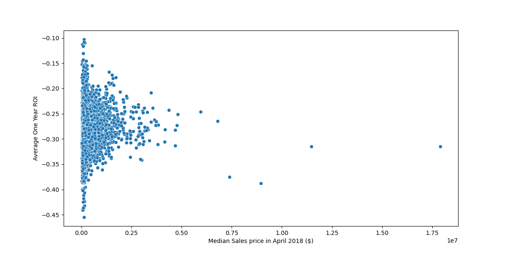

# Real Estate Price Forecasting

## BUSINESS PROBLEM

## BUSINESS UNDERSTANDING

Real Estate investors have chosen to consult the services of Real Estate InvestmentAI to help predict the more profitable areas to invest in properties found in over 14,000 zipcodes in the United States. The aim is to choose the zipcode areas with the highest Return On Investment(ROI) and to forecast f
uture prices in the areas with the highest ROI.

This project aims to utilize a Time Series Model to forecast the prices of properties in various zipcodes in U.S.

## ABOUT THE DATA

The data is obtained from the [Zillow Research Data](https://www.zillow.com/research/data/). It represents the median monthly property prices for 14,723 zipcode area in the United States of the period April 1996 to April 2018
This data represents median monthly housing sales prices for 265 zip codes over the period of April 1996 through April 2018 as reported by Zillow.

Each row represents a unique zip code. Each record contains location info and median housing sales prices for each month.

## DATA UNDERSRTANDING

This dataset represents the median monthly home sales prices for the 265 zip codes from April 1996 to April 2018 according to Zillow statistics.
A distinct zip code is represented by each row. Each record includes area details and monthly median sales prices for homes.
There are 14,723 rows and 272 variables:

* `RegionID`: Unique index, 58196 through 753844
* `RegionName`: Unique Zip Code, 1001 through 99901
* `City`: City in which the zip code is located
* `State`: State in which the zip code is located
* `Metro`: Metropolitan Area in which the zip code is located
* `CountyName`: County in which the zip code is located
* `SizeRank`: Numerical rank of size of zip code, ranked 1 through 14723
* `1996-04 through 2018-04`: refers to the median housing sales values for April 1996 through April 2018, that is 265 data points of monthly data for each zip code

## MODELING PROCESS

The initial step involved exploration of the data, data cleaning/ scrubbing. It was found that many zipcodes did not have the full range of data, they had data only from 06-2014. I chose not toeliminate any as they were all possible considerations towards high Return On Investment(ROI).

Next, was to calculate the ROI for each zipcode using varying ranges of dates. 1, 5 and 10 year before the data 04-2018. This was necessary to realize trends in the different zipcodes, in that one area may have been more profitable as a time while not profitable at another. In the end resorted to using the average over a 3-year period and use it to determine the top 5 zipcodes with high ROI as prospectively profitable areas for the small investors.

## PRESENTATION LINKS AND SOURCES

## CONCLUSION

## CAVEATS

## FUTURE WORK
* it maybe important to factor in other metrics like `SizeRank`,
* presence of a `Metro`(metropolitan area) to explain the prices of the propertiees
*

## REPOSITORY STRUCTURE * add the names n brif description
├── visualizations
│   ├── rating_vs_genress.png
│   ├── return_on_investment_vs_genres.png
│   ├── correlation_between_runtime_and_average_rating.png
├── Data
│   ├── zillow_data.csv
├──.env
├──.gitignore
├── README.md
├── student_notebook.pdf
├── presentation.pdf

==================

├── README.md
├── student_notebook.ipynb
├──.gitignore
├──.gitignore

└── data
    └── zillow_data.csv

├── package.json
├── package-lock.json
├── README.md
└── src
    ├── app.js
    ├── models.js
    ├── routes.js
    └── utils
        ├── another.js
        ├── constants.js
        └── index.js

